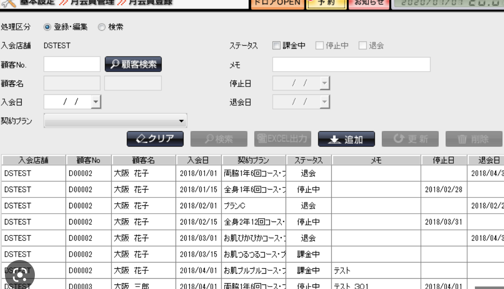

<!-- 
_class: cection-title
 -->

# 世界は俺らが守ったる

## 開発メンバー
1. Thai Van Danh
2. Tran Quoc Thien
3. 林 良輝
4. 藤嶌 伊音

----

<!-- 
_class: title-and-body
 -->

# アジェンダ

- 問題定義
- 現状分析
- 企画概要
- デモンストレーション
- 今後の展望

---

<!-- 
_class: cection-title
 -->

# 問題定義

---

<!-- 
_class: title-and-body
 -->

# 問題定義

## __健康意識__ について
  
コロナが始まり３年が経過した今、コロナの影響により日本の健康意識は右肩上りに上がり続けています。

---

<!-- 
_class: title-and-body
 -->

# 問題定義

明治の調べでは、コロナにより __約半数__ が 健康意識 高まったと回答しています。

---

<!-- 
_class: title-and-body
 -->

# 問題定義

## なぜ健康意識は高まったのか？

ステイホームや自粛により、__外出__ が減り、
__運動__ が減った 
__太った__ 
__運動不足__ etc...

---

<!-- 
_class: title-and-body
 -->

# 問題定義

__健康意識__ の中でも私たちは、__運動__ に注目しました、明治の調べでは、__50%__ の人が食事や栄養を、__35%__ の人が運動を心がけるようになったと回答しています。

---

<!-- 
_class: title-and-body
 -->

# 問題定義

さらに、ヒップによると、健康意識が高まり、運動不足を解消するために、筋トレを始めた人は __33%__ にまで登っています。

---

<!-- 
_class: title-and-body
 -->

# 問題定義

筋トレを始めた人が多くなった背景には __2020__ の __筋トレブーム__ が背景にあると考えました。
__2020__ の __筋トレブーム__ は筋トレだけではなく、健康意識を爆発的に高めた要因の１つです。
__2022年__ ,には多様化が進み様々な形の、ジムが誕生しました。

---

<!-- 
_class: title-and-body
 -->

# 問題定義

ジム満足度調査では、数ある中からパーソナルジムが効果満足度１位でした。

---
<!-- 
_class: title-and-body
 -->

# 問題定義
しかし、パーソナルジムの退会理由は、効果に満足できないなどが代表的でした。
そこで、私たちは、__効果をより効率よく__、結果を出すための __筋トレ管理アプリケーション__ を開発しました。

---

<!-- 
_class: cection-title
 -->

# 現状分析

---

<!--
_class: title-and-body
 -->

# 現状分析

現状、__筋トレ管理アプリ__ は多くありますが、大きく分けて __2種類__ に分けられます。

---

<!--
_class: title-and-body
 -->

# 現状分析

## 1. 顧客管理型システム型

<!-- ユーザーを顧客として、積極的にアプリを使ってもらい、店舗に来てもらうことを目的としたアプリや、
アプリを月額のサブスクライブ制にして、利用者を継続的に獲得するシステムなどです。
特徴としては、顧客の契約や、トレーニングのスケジュール調整などができます。 -->

---

<!--
_class: title-and-body
 -->

# 現状分析

## 2.  ジム密着型管理システム

<!-- ジムの管理者が、ジムの利用者の情報を管理するためシステムです。
ここでは、ジムがシステムを購入し、利用者の個人カルテや、トレーニングのスケジュール調整などができます。
特徴としては、ジムの利用者の情報を管理することが目的です。 -->

---

<!--
_class: title-and-body
 -->

# 現状分析

## 二つのシステムの問題点、

1. ユーザ依存になりやすい、__ジム__ には、トレーニングするためだけの施設ではなく、トレーナーと二人三脚で、ユーザーの理想体型に近づけるためのサポートを行うべきですが、できていない
2. 効果を出すためには、トレーナとのコミュニケーションが必要ですが、システムを使うと、トレーナーとのコミュニケーションがあまりとれていない

---

<!-- 
_class: cection-title
 -->

# 企画概要

---

<!--
_class: title-and-body
 -->

# 企画概要

webアプリケーションとして、__筋トレ管理アプリ__ を開発しました。

フロントは __React + TypeScript__ で開発しました。
バックエンドは __Node.js + Express__ で開発しました。

---
<!-- 
_class: cection-title
 -->

# デモンストレーション

---

<!-- 
_class: cection-title
 -->

# 今後の展望 

---

<!--
_class: title-and-body
 -->

# 今後の展望 

## 今後の展望

現在開発中のチャット機能を完成させ、完成まじかの、グラフ機能も実装し、本番サーバでの稼働をしたいとおもいます。
ゆくゆくはモバイルのアプリ開発もしたいと開発したいと考えています。

