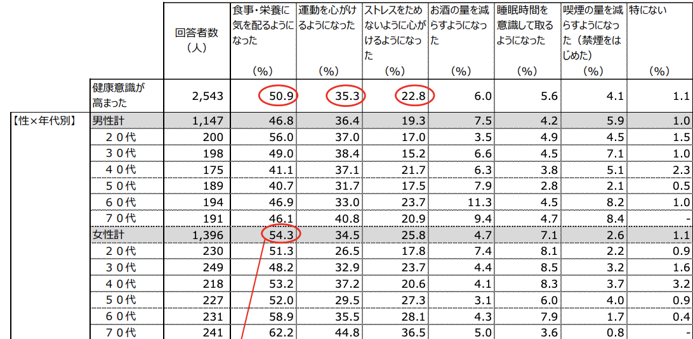

<!-- 
_class: cection-title
 -->

# 世界は俺らが守ったる

## 開発メンバー
1. Thai Van Danh
2. Tran Quoc Thien
3. 林 良輝
4. 藤嶌 伊音

----

<!-- 
_class: title-and-body
 -->

# アジェンダ

- 問題定義
- 現状分析
- 企画概要
- デモンストレーション
- 今後の展望

---

<!-- 
_class: cection-title
 -->

# 問題定義

---

<!-- 
_class: title-and-body
 -->

# 問題定義

## __健康意識__ について
  
コロナが始まり３年が経過した今、コロナの影響により日本の健康意識は右肩上りに上がり続けています。

---

<!-- 
_class: title-and-body
 -->

# 問題定義

明治の調べでは、コロナにより約半数が __健康意識__ 高まったと回答しています。

---

<!-- 
_class: title-and-body
 -->

# 問題定義

## なぜ健康意識は高まったのか？

ステイホームや自粛により、__外出__ が減り、
__運動__ が減った 
__太った__ 
__運動不足__ etc...

---

<!-- 
_class: title-and-body
 -->

# 問題定義

__健康意識__ の中でも私たちは、__運動__ に注目しました、明治の調べでは、__50%__ の人が食事や栄養を、__35%__ の人が運動を心がけるようになったと回答しています。

---

<!-- 
_class: title-and-body
 -->

# 問題定義

さらに、ヒップによると、健康意識が高まり、運動不足を解消するために、筋トレを始めた人は __33%__ にまで登っています。

---

<!-- 
_class: title-and-body
 -->

# 問題定義

筋トレを始めた人が多くなった背景には __2020__ の __筋トレブーム__ が背景にあると考えました。
__2020__ の __筋トレブーム__ は筋トレだけではなく、健康意識を爆発的に高めた要因の１つです。
__2022年__ ,には多様化が進み様々な形の、ジムが誕生しました。

---

<!-- 
_class: cection-title
 -->

# 問題定義

ジム満足度調査では、数ある中からパーソナルジムが効果満足度１位でした。

---
<!-- 
_class: cection-title
 -->

# 問題定義
しかし、パーソナルジムの退会理由は、効果に満足できないなどが代表的でした。
そこで、私たちは、__効果をより効率よく__、結果を出すための __筋トレ管理アプリケーション__ を開発しました。

---

<!-- 
_class: cection-title
 -->

# 現状分析

---

<!-- 
_class: cection-title
 -->

# 企画概要

---

<!-- 
_class: cection-title
 -->

# デモンストレーション

---

<!-- 
_class: cection-title
 -->

# 今後の展望

---
